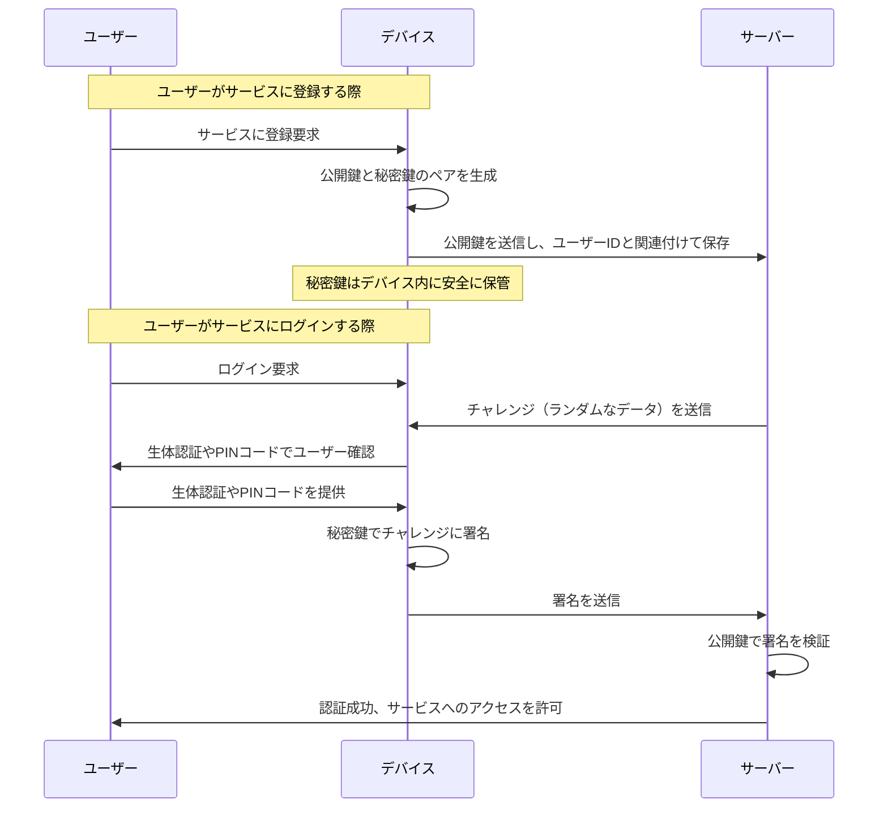
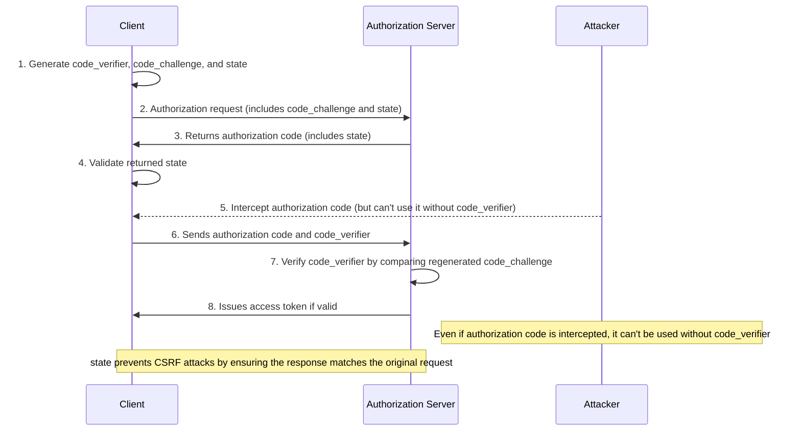

## パスキーの基本のフロー




## 値の伝搬について

他のクラスや構造体へ値を渡す際に、本来必要なのはいくつかのプロパティの場合にそれを個別で渡すか、それともインスタンスごと渡すか。

「受け取る側が実際に必要とする情報のみ」を渡すべき。

例
```.swift
struct Car {
  let name: String
  let model: String
  let engineType: String
  let createdAt: Date
}
```

* 必要最小限の情報
受け取る側が name と model だけを使うなら、引数として個別に渡すか、あるいはそれらだけをまとめた専用の構造体（たとえば CarSummary など）を用意するのが望ましい。こうすることで、関数のシグネチャが明確になり、不要な依存性がなくなる。

* 全体の設計との整合性
受け取る側が将来的に Car 全体の情報を必要とする可能性があるなら、最初から Car 全体を渡すのもあり。ただし、その場合でも、使わないプロパティまで渡すことにより依存性が増え、テストや保守性に影響が出る可能性がある。

## 基本機能を阻害しないような追加の実装をする

特定の機能があり、それがあると嬉しいがなくてもOKである場合、

* 例えばそれに使用しているAPIがある場合に、そのエラー時にメイン操作は影響受けないか
* 例えばそれに使用しているAPIがある場合に、そのAPIの取得が入ったが故に既存機能の表示が遅くなっていないか → 同期処理にしない

といった点の考慮が必要

## Base64

* 64進数を意味し、データをアルファベット（a-z、A-Z）、数字（0-9）、記号（+、/）の64文字で表現するエンコード方式。データ長を揃えるために、末尾にパディングとして=を使用するので実質65文字での表現となる。
* Base64の経緯:かつての電子メールプロトコルSMTPでは、ASCIIの7ビット英数字しか送信できなかった。画像や音声データを送受信するために、すべてのデータを英数字で表現するMIME規格が登場し、その中でBase64という変換方法が定められた。
* 現在では、JSONで特殊文字を含まないように画像データをBase64でエンコードしたり、Webページでリクエスト数を減らすためにBase64でエンコードした画像をHTMLに埋め込む（HTML内ではバイナリデータを直接扱うことはできないので変換が必要）などの用途で使用されている。
* Base64の変換アルゴリズム:
  * 変換したい文字列をバイナリ（2進数）に変換する。
  * バイナリを6ビットずつに分割する。
  * 最後に余ったビットが6ビットになるように0を追加する。
  * 変換表を用いて、6ビットの値を対応する文字に変換する。
  * 4文字ずつに分けて、足りない部分は=を追加する。
  * これでBase64の文字列が完成する。

https://qiita.com/PlanetMeron/items/2905e2d0aa7fe46a36d4

## BEの処理結果が正しいかをクライアントでも確認すべきかどうか

*  冗長な確認は通常必要ない。APIが適切に設計されていれば、そのレスポンスを信頼すべき
*  ただし、信頼性の問題が懸念される場合や、システム全体の整合性を保証する必要がある場合（サーバー側の状態が直ちに反映されるか保証できない場合や、結果がシステム全体に重大な影響を及ぼす場合）は再確認の仕組みを導入しても良い
*	一般的には、サーバーが「完了」を保証し、クライアントはそれを信頼するのがよい

ChatGPTより

## [OWASP MASVS と MASTG の採用 | owasp-mastg-ja](https://coky-t.gitbook.io/owasp-mastg-ja/0x02b-masvs-mastg-adoption)

## PKCE

PKCE (Proof Key for Code Exchange) はOAuth 2.0 の認可コードグラントにおけるセキュリティを強化するものである。以下が、PKCE フローの主なメリット

* 認可コードインジェクション攻撃の防止

PKCE フローでは、認可コードのやり取りにおいて code_verifier と code_challenge を使用することで、認可コードが攻撃者によって盗まれたり、差し替えられたりしても、攻撃者はアクセストークンを取得できません。これにより、認可コードインジェクション攻撃（「コードインターセプト攻撃」）を防止します。

* クライアントシークレットが不要

従来の OAuth 2.0 の認可コードグラントフローでは、クライアントシークレットが必要でした。しかし、モバイルアプリや SPA ではクライアントシークレットを安全に保持することが困難です。PKCE フローは、クライアントシークレットを使用せずに同等のセキュリティを提供します。

* セキュリティの簡易化
  

PKCE フローを導入することで、クライアント側でのセキュリティ実装が簡素化され、より多くのアプリケーションで安全に OAuth 2.0 認証を利用できるようになります。特に、Web、モバイル、デスクトップアプリケーションなど、幅広いクライアントに対応できます。

* CSRF 攻撃の防止

CSRF: 被害者のクライアントアカウントに攻撃者のリソースが意図せず紐づけされる脆弱性。操作した結果攻撃者のリソースになるので情報漏洩や、特定の操作に認証が使われている場合にその認証が悪用されるので不正な状態変更などが発生する。

PKCE フローでは、state パラメータを使用して CSRF 攻撃を防止します。このパラメータにより、認可リクエストと認可サーバーからのレスポンスが正しく関連付けられていることを確認できます。




## N+1問題

N+1 問題はデータベースでのクエリの最適化に関する問題。  
この問題の根本的な課題は、一覧画面を表示するときに行うデータベースクエリの数が非効率的に増えてしまうこと。具体的には以下のような状況が発生する：

1. 最初のクエリは一覧に表示するデータを取得するために実行（1回のクエリで、Nレコードが返される）。
2. 次に、取得した各レコードの関連データを取得するために、N回のクエリが実行される。

これにより、データベースアクセスがN+1回実行されることになり、これがN+1問題と呼ばれる。  
順序的に1+Nとした方が理解し易い。

この問題にはいくつかの対応策がある：

### 1. JOIN句を使う
関連するテーブルをJOIN句を使って結合し、1回のSQLクエリで必要なデータをすべて取得するもの。このアプローチは、クエリが1つだけであるため効率的だが、結合自体には時間がかかる場合がある。

### 2. Eager Loading
テーブルからデータを取得する際に1回のクエリを発行し、その後別のテーブルから今後の処理に必要なデータを一度に取得するもの。データ取得後、アプリケーション側でデータの結合や他の処理を行う。この方法の利点は、データベースへのクエリが2回しかないため、データベースの負荷を大幅に削減できることである。

参考
* [[解説] SQLクエリのN+1問題 - Qiita](https://qiita.com/muroya2355/items/d4eecbe722a8ddb2568b)
* [Railsライブラリ紹介: N+1問題を検出する「bullet」 | TECHSCORE BLOG](https://www.techscore.com/blog/2012/12/25/rails%E3%83%A9%E3%82%A4%E3%83%96%E3%83%A9%E3%83%AA%E7%B4%B9%E4%BB%8B-n1%E5%95%8F%E9%A1%8C%E3%82%92%E6%A4%9C%E5%87%BA%E3%81%99%E3%82%8B%E3%80%8Cbullet%E3%80%8D/)

## 暗号化方式

共通鍵暗号と公開鍵暗号の2つがある。

| 暗号化方式         | 共通鍵暗号                       | 公開鍵暗号                           |
| ------------------ | -------------------------------- | ------------------------------------ |
| 暗号化アルゴリズム | RC4、DES、3DES、AES              | RSA、ElGamal                         |
| 使用する暗号鍵     | 共通鍵                           | 公開鍵、秘密鍵                       |
| 鍵の管理           | 通信接続先ごとに作成             | 通信接続先の数に関係なく１つだけ作成 |
| 鍵の交換           | 第三者に知られないよう安全に交換 | 作成した公開鍵を一般に公開           |
| データの処理時間   | 速い                             | 遅い                                 |

SSL/TLS通信では、このハイブリッド方式が「デジタル署名」と「デジタル証明書」の技術と組み合わせて使用される。

公開鍵暗号において、正しい公開鍵が使用されているかどうかの保証をするために認証局の発行したデジタル証明書を利用できる。


### 参考

* [ネットワークエンジニアとして](https://www.infraexpert.com/)

## 改行コード

* \n(LF)：Unix系OS全般、Mac OS X
* \r\n(CR+LF)：Windows系OS
* \r(CR)：古いMac OS（9以前）

## 開発のパフォーマンスについての指標

Four Keysという指標がある。  
開発のパフォーマンスを図るもので、科学的根拠のある 「LeanとDevOpsの科学」より

* [DevOpsの4つのキーメトリクスの計測から学んだこと - 改善すべき領域の特定](https://www.infoq.com/jp/news/2021/[]08/measuring-four-key-metrics/)
* [Four Keys 〜自分たちの開発レベルを定量化してイケてる DevOps チームになろう〜 - Tech Blog - Recruit Engineer](https://blog.recruit.co.jp/rls/2021-03-31-four-keys/)
* [エンジニア組織の生産性の可視化とは？ 〜『DevOps指標』を活用しよう〜 | Findy Team+ Lab](https://blog.findy-team.io/posts/engineering_org_devops_metrics/)
  * Findy Teamsの考えのベースになっている

## 画像形式

### ビットマップ画像

> ビットマップ画像とは、コンピュータグラフィックスにおける画像の表現形式で、ピクセルを用いたもの。画像をドットマトリクス状のピクセル群として捉え、RGB等の表色系に基づいたピクセルの色・濃度の値の配列情報として取り扱う。

 [ビットマップ画像 - Wikipedia](https://ja.wikipedia.org/wiki/ビットマップ画像)

### ベクター画像

> ベクター画像とは、画像データの表現形式の一つで、画像を図形を表す数値情報の集合として表現したもの。
> 画像を単純な図形の集合として表現する方式で、輪郭などを構成する点の位置や、それらを結ぶ直線や曲線を表す方程式のパラメータ、変形・回転など操作情報、線や面の色情報などの組み合わせとして記述する。

[ベクター画像（vector image）とは - IT用語辞典 e-Words](https://e-words.jp/w/%E3%83%99%E3%82%AF%E3%82%BF%E3%83%BC%E7%94%BB%E5%83%8F.html)

## カレンダー

* [Your calendrical fallacy is thinking…](https://yourcalendricalfallacyis.com/)
  * カレンダー関連の実装で気を付けるべきことが書かれている

## 設計

* 共通化するかどうか迷ったら、それが変わりやすいかどうかを考える。基本的に変わるということを加味して分けた方が以後のコードがシンプルになる。部分的に共通のものを使用するのはあり。深いところから共通化するのを避けるのが良さそう。

### [Domain model purity vs. domain model completeness (DDD Trilemma)](https://enterprisecraftsmanship.com/posts/domain-model-purity-completeness/)

- Domain model completenessは、ドメインモデルにすべてのアプリケーションのドメインロジックが含まれている場合。
  - その逆はドメインロジックの断片化。ドメインロジックがドメインレイヤー以外のレイヤーに存在する場合にこれになる。
- Domain model purityは、ドメインモデルがプロセス外に依存しない場合。
- ほとんどのユースケースでは、次の3つの属性すべてを達成することはできない。
  - Domain model completeness
  - Domain model purity
  - パフォーマンス
- trilemma
  - すべての外部の読み取りと書き込みをビジネス処理側に押しやる - Domain model completenessとpurityを達せするが、パフォーマンスを妥協する。
    - （例）ユーザー情報の全てを関数に渡す
  - ドメインモデルにプロセス外の依存関係を注入する - パフォーマンスとDomain model completenessを達成するが、Domain model purityを犠牲にする。
    - （例）ユーザー情報を取得できるIFを持つものを関数に渡す
  - ドメインレイヤーとコントローラーの間で意思決定プロセスを分割する - パフォーマンスとDomain model purityの両方を達成できるが、completenessを妥協する。
    - （例）他のユーザー情報を必要とするバリデーション処理はコントローラー側で対応する
- アプリケーションのパフォーマンスに大きなダメージを与えることなく、すべての外部の読み取りと書き込みをビジネス処理側に押しやることができる場合は、このオプションを選択するのが良い。
- それ以外の場合は、completenessよりもドメインモデルのpurityを優先するのが良い。
  - ドメインロジックの断片化の方が、ドメインモデルがプロセス外のものに依存するよりもまし。ビジネスロジックは、アプリケーションの最も重要な部分。それはまた、最も複雑な部分でもある。プロセス外の依存関係と連携するという追加の責務と混在させると、そのロジックの複雑性は上がる。また、ドメインモデルをテストする際にモックやスタブが必要なくなるというメリットもある。

### A Philosophy of Software Design

Design Principles

* 複雑さは漸進的なものだ：小さなことに汗をかかなければならない。Complexity is incremental: you have to sweat the small stuff (see p. 11). 
* 動くコードだけでは十分ではない。Working code isn’t enough (see p. 14). 
* システム設計を改善するために、継続的に小さな投資を行う。Make continual small investments to improve system design (see p. 15). 
* モジュールは深くあるべきだ。Modules should be deep (see p. 23) 
* インターフェースは、最も一般的な使い方をできるだけシンプルにするように設計されるべきである。Interfaces should be designed to make the most common usage as simple as possible (see p. 27). 
* モジュールは単純な実装よりも単純なインタフェースを持つことの方が重要である。It’s more important for a module to have a simple interface than a simple implementation (see pp. 61, 74). 
* 汎用モジュールはいっそう深いものである。General-purpose modules are deeper (see p. 39). 
* 汎用的なコードと特殊なコードを分離する。Separate general-purpose and special-purpose code (see pp. 45, 68). 
* 異なるレイヤーは異なる抽象度を持つべきである。Different layers should have different abstractions (see p. 51). 
* 複雑さを下方に引き下げる。Pull complexity downward (see p. 61). 
* エラーを存在しないように定義する。Define errors out of existence (see p. 81).
* 設計は2回行う。Design it twice (see p. 91). 
* コメントには、コードから明らかでないことを記述する。Comments should describe things that are not obvious from the code (see p. 101). 
* ソフトウェアは、書きやすさではなく、読みやすさを重視して設計すべきである。Software should be designed for ease of reading, not ease of writing (see p. 151). 
* ソフトウェア開発の増分は、機能ではなく抽象化であるべきである。The increments of software development should be abstractions, not features (see p. 156). 
* 重要なものとそうでないものを分け、重要なものを強調する。Separate what matters from what doesn’t matter and emphasize the things that matter (see p. 171).

Red Flags

* 浅いモジュール：クラスやメソッドのインターフェイスが、その実装よりも単純でない。Shallow Module: the interface for a class or method isn’t much simpler than its implementation (see pp. 25, 110).
* 情報漏洩：設計上の決定が複数のモジュールに反映される。Information Leakage: a design decision is reflected in multiple modules (see p. 31). 
* 時間的分解：コード構造は、情報隠蔽ではなく、操作の実行順序に基づいている。Temporal Decomposition: the code structure is based on the order in which operations are executed, not on information hiding (see p. 32).
*  過剰な露出： よく使われる機能を使うために、めったに使われない機能を意識することを呼び出し側に強いるAPI。Overexposure: An API forces callers to be aware of rarely used features in order to use commonly used features (see p. 36). 
* パススルー・メソッド(Pass-Through Method): メソッドは引数を似たシグネチャを持つ別のメソッドに渡す以外、ほとんど何もしない。Pass-Through Method: a method does almost nothing except pass its arguments to another method with a similar signature (see p. 52).
* 繰り返し：nontrivialなコードの断片が何度も繰り返される。Repetition: a nontrivial piece of code is repeated over and over (see p. 68).
* 特別なコードと一般的なコードの混在：特別な目的のコードが、一般的な目的のコードからきれいに分離されていない。Special-General Mixture: special-purpose code is not cleanly separated from general purpose code (see p. 71).
* 結合したメソッド：2つのメソッドが非常に多くの依存関係を持ち、一方の実装を理解す るには、もう一方の実装を理解しなければ難しい。Conjoined Methods: two methods have so many dependencies that its hard to understand the implementation of one without understanding the implementation of the other (see p. 75). 
* コメントでコードが繰り返される：コメント内のすべての情報は、コメントの隣のコードからすぐにわかる。Comment Repeats Code: all of the information in a comment is immediately obvious from the code next to the comment (see p. 104). 
* 実装の文書がインタフェースを汚染する：インタフェースのコメントには、文書化されたものを見る人が必要としない実装の詳細が記述されている。Implementation Documentation Contaminates Interface: an interface comment describes implementation details not needed by users of the thing being documented (see p. 114).
* 曖昧な名前：変数名やメソッド名があまりに不正確で、有用な情報をあまり伝えない。Vague Name: the name of a variable or method is so imprecise that it doesn’t convey much useful information (see p. 123).
* 名前を選ぶのが難しい：実体の正確で直感的な名前を思いつくのが難しい。Hard to Pick Name: it is difficult to come up with a precise and intuitive name for an entity (see p. 125). 
* 記述が難しい：完璧であるためには、変数やメソッドのドキュメントは長くなければならない。Hard to Describe: in order to be complete, the documentation for a variable or method must be long. (see p. 133). 
* 自明でないコード：コードの動作や意味を簡単に理解することができない。Nonobvious Code: the behavior or meaning of a piece of code cannot be understood easily. (see p. 150).


## Cache

ブラウザがウェブページの要素（画像、CSS、JavaScriptファイルなど）をローカルに保存するもので、これによりウェブページの読み込み速度が向上し、全体的なユーザーエクスペリエンスが改善される。ユーザーが同じページを再度訪れると、すでにダウンロードされ保存されている要素が表示されるため、ページの読み込み時間が大幅に短縮される。

## Cookie

ウェブサイトとユーザーのブラウザ間で行われる情報の交換であり、サーバーがブラウザに特定の情報（ログイン状態など）を送信し、ブラウザはそれを保持する。次にユーザーが同じウェブサイトを訪れるとき、ブラウザはその情報をサーバーに返し、ユーザーの以前のアクションや設定を「覚えている」状態を作り出す。これにより、個々のユーザーエクスペリエンスのカスタマイズが可能となる。

[基礎知識　Cookieの仕組み](https://www.soumu.go.jp/main_sosiki/joho_tsusin/security_previous/kiso/k01_cookie.htm)

## コードレビュー

### レビューの観点

*　レビュアー、レビュイーの技量や立場によって異なるが、下記のような観点がある
  * コーディング・スタイルやコードの読みやすさ
  * アルゴリズムやロジックの効率や正しさ
  * エラー処理
  * セキュリティ・ホール
  * データ隠蔽（公開範囲の制限）

レビューする人も人間なので、コードからバグをすべて見つけることは不可能。なので、「バグが出にくいコードになっているか？」という観点を意識するのが現実的。

### レビューの遅延

レビューが遅延すると、

* レビュワーのスイッチングコストの増加
* レビュイーがレビューを気にすることによるメモリ増加
* 他のタスクが依存している場合、その遅延

が発生する。  
レビュイーはコミットやプルリクエストにおいてレビューがしやすくなるような工夫し、レビュワーはなるべく早く対応するように心掛けるべき。

[On Code Review. In which the author makes a strong… | by Glen D Sanford | Medium](https://medium.com/@9len/on-code-review-16ea85f7c585)

## 水平/垂直スケール

* 水平スケール（スケールアウト）
システムのリソースを追加することによって性能を向上させる方法。例えば、複数のサーバー間で負荷を分散することを意味する。新しいサーバーを追加することで、アプリケーションやデータベースの負荷を軽減し、同時に複数の要求を処理できるようになる。

* 垂直スケール（スケールアップ）
既存のシステム内でリソースを増やすことによって性能を向上させる方法。CPU、メモリ、ストレージなどのリソースを拡張することで実現される。

## ディープリンク

* Custom URL Scheme

  * アプリ専用にSchemeをつくる

  * アプリがインストールされていないと、エラーが表示される。

  * 同じSchemeをもつアプリを複数インストールしていると、ハンドリングできない。

  * Warning

    * > URL schemeはアプリ内の潜在的な攻撃経路（attack vector）となるので、URLパラメータの全てを検証し、不正なURLは破棄してください。また、URL Schemeによって行えるアクションをユーザーのデータにリスクが無いように制限してください。例えば、他のアプリにコンテンツを削除させたり、ユーザーに関するセンシティブな情報にアクセスさせないことです。URLを処理するコードのテストを書く時は、不正なURLが含まれるテストケースが含まれていることを確認してください。

* Universal Links ( iOS ) と App Links ( Android )

  * 特定のURLでWebサイトにアクセスする際に、アプリをインストールしていればアプリ内の特定のコンテンツに遷移させ、インストールされていなければそのままWebサイトを表示、またはアプリストアに遷移させる仕組み
  * iOSとAndroidで要素技術が違うので、開発者は各OSに対応して実装を行う
    * iOSでの実装方法: [Allowing Apps and Websites to Link to Your Content | Apple Developer Documentation](https://developer.apple.com/documentation/xcode/allowing-apps-and-websites-to-link-to-your-content?preferredLanguage=occ)

* Firebase Dynamic Links

  * Firebase Dynamic Linksはディープリンク提供サービスであり、iOS・Android・PC共通で使えるディープリンクURLを作成・管理できる
  * Firebaseを使うことでディープリンクの導入が簡潔になり、OS間の差分を吸収してくれる
  * リンクを開いた後の挙動などの設定をFirebaseコンソールからGUIで簡単に操作できる
  * URLの長押しで表示されるメニューで「ブラウザで開く方」を選択するとそのドメインは以後アプリで開かなくなる（設定が保存される）。再度URL長押しでアプリで開くを選択するとそのドメインの設定が上書き保存される

### 参考

* [アプリをURLで起動する](https://www.notion.so/URL-176950ae6f5241da892826148b66f601)
* [モバイルアプリにおけるディープリンクとメルカリShopsでの実装 | メルカリエンジニアリング](https://engineering.mercari.com/blog/entry/20220224-deeplink-for-mercari-shops/)

## テスト

### 仕様の記述

BDD によるテストコードでは「振る舞い」を表現するために次のように記載される

（前提）Given: 事前に準備する値の設定  
（いつ）When: 実行（実行のタイミング）  
（どうなるか）Then: 検証コード  

これは仕様の記述にも使える。

また、画面設計のときに書けばViewModelやPresenterのプロトコルを書きやすい
その際は下記のようになる

``` 
・Given （前提）
・When （どういう時に）
  アクション
  見ている箇所
・Then（どうなるか）
  どんなUIがあるか
  （実装時）どんなデータを使用するか
```

### ソフトウェアにおける品質の種類

* 外側の品質: 利用者から見た品質
  *  必要な機能が満たせているか 
  *  操作性は問題ないか
  *  画面の表示崩れは無いか
  *  クラッシュしないか
* 内側の品質: 開発者から見たソフトウェアの内部構造における品質
  * アーキテクチャやクラス設計は適切か
  * 利用しやすい API 設計になっているか
  * コードの可読性は保たれているか

「外側の品質」と「内側の品質」の担保について  

「あるべき振る舞いのテストを先に書く」ことで、最初になにを作るべきかを明確にし、外側からテストできる設計を考えるこ とを強制させることで「外側の品質」を支えられる。
「TDDプラクティス（RED → GREEN → Refactor）」を行うことで、最初に利用しやすい API を検討させ、リファクタリングによるコードの可読性や設計の改善により、「内側の品質」を支え ます。

### テストの保守性

* テストケース名をわかりやすくする

  * `test <テスト対象メソッド>_<テストの説明>`
  * テストレポートに情報として載る形式で記載するのがいい。 ほとんどのテスティングフレームワークではコメントを認識しないため、テストレポートからは情報として欠落してしまう

* テストを適切な粒度に保つ

  * テストケース名長くなったらそれは粒度大きい

* テストの構造をわかりやすくする

  * テストフィクスチャの定義をまとめる

* 失敗時のエラーメッセージをわかりやすくする

  * ```swift
    XCTAssertNil(rot13.encode("Hello!"),"文字列`Hello!`には記号である!が含まれているので結果がnilになること")
    ```

  * テスト失敗時のエラーメッセージをわかりやすくしておくことで、実際にテストが失敗したときに、その原因の調査や修正にかかるコストを下げることに繋がる

### テストデータを選ぶ

* 同値分割
  * テスト対象が同じ振る舞いをすると想定されるデータを、ひとつのグループとして みなして分割する考え方。各グループでは、どの値を選んでも同じ振る舞いになることが想定されるので、そのグループ内 から代表値をひとつだけ選べばよいという考え方ができます。
* 境界値
* 単項目チェック
  * 一つの条件に対してテストを行う。組合せ爆発といった場合に有効

### テストの構造化

テストの構造化をすることで複雑なテストを整理・共通化でき、テストのメンテナンスがしやすくなる。任意の条件を持つテストをまとめる。
XCTestだと`runActivity(named:block:)`でまとめることができる。

### ランダム

テストの実行順序をランダム化することで、複数のテストメソッド同士に実行順序の依存関係が生まれることを防げる。
複数のテストメソッド同士に依存関係が発生すると、テストが壊れたときに別のテストも壊れてしまったり、問題の切り分けがしづらくなってしまったりする。

### 何をテストすべきか

  * API通信のテスト
    * APIの開発を待たなくてよい
    * 様々なレスポンスケースで確認
  * 手動で発生させることが難しいケースのテスト
    * 時間がかかるもの
      * 日数の経過がトリガー
      * 1分間に1億タップすることがトリガー

### 心持ち

> 「不安」という感情は一時的に見えても、ソフトウェア開発のような知能労働においては、生産性 に大きく影響します。後述するテスト駆動開発では、そういった感情を大切にしますし、エクスト リーム・プログラミング(XP)においては、価値として「勇気」をおいています。
>
> テストケースについて考える際は、機械的なアプローチによって効率的にテストを減らすだけでなく、費用対効果を意識し、時には感情についても考慮することで、品質のよいソフトウェアを継続的にリリースし続けられる強い組織になるでしょう。

### 参考

* 松尾 和昭，細沼 祐介，田中 賢治，平田 敏之，玉城 信悟，横田 孝次郎，加藤 寛人　（2019）．　iOSテスト全書　PEAKS出版

## ドキュメント作成

どうすれば良いドキュメントができるか

> トップダウンでドキュメントが必須だと明確にチームに伝える
開発する上で書く必要のあるドキュメントの種類を明確にする
SSOT(Single Source Of Truth)を意識してドキュメントを更新し続ける
チャットの履歴を一定期間しか残さない

* [プロダクト開発でドキュメントを書かないとどうなるか](https://product-develop.com/2c981f18e9924410bb266a5fd87343c2)

## 認証と認可


[よくわかる認証と認可 | DevelopersIO](https://dev.classmethod.jp/articles/authentication-and-authorization/#return-note-184783-1)

## 不具合報告と対応

* **本当に不具合であるかの確認**
  * 不具合の報告はサービス責任者からすると不具合でないケースも存在します。
    従ってまずは不具合であるかどうかを、サービス責任者が確定することが必要です。
  * 不具合であるかどうかは下記要素で確定します。
    * 仕様と矛盾がある
    * 明らかに不自然な挙動（仕様に明記されていないが、同等のサービスと比較して明らかに不自然である。たとえば、アプリケーション起動状態が数分続くとアプリケーションが終了するなど）
  * **不具合でない場合**
    * 参照資料をもとに現在の事象を説明
  * **不具合である場合**
    * 期待する結果と現在の結果を明記
    * **再現できる場合**
      * 再現環境、手順の明確化
      * 不具合への対処
        * 仮説、検証を繰り返す
    * **再現しない場合**
      * 仮説、検証により再現する方法を確認
      * 製品版にログを挿入し、詳細な情報を取得できるようにしそれをもって再度調査する

**デバッグ時の記述方針**

* 事実を記載
* 推測は断定しない内容で記載

## 見積もり

* サーバー側の工数を見積もる上では、画面という切り口で見積もるより、業務ドメインという単位で見積もるのが画面ベースより良さそう

## 命名

* 真偽値の命名

  * is始まりを検討する

  * それ以外の「動詞」、「助動詞」を検討
    exists (存在するか)
    contains (含まれているか)
    has (持っているか)
    needs (必要か)

    can (できるか)（is ~able でもok）
    should (すべきか)
    need (する必要があるか)
    
## Data URI scheme

データを直接埋め込む手段を提供するURIスキーム

例えば下記をブラウザで実行するとデータが閲覧できる  
data:image/svg+xml;base64,{base64エンコードされたデータ}

## UML

### クラス図

| 関係        | 説明                                                         | marmaid での表記<br />（A,Bは説明のため記載） |
| ----------- | ------------------------------------------------------------ | --------------------------------------------- |
| Association | 関連<br />BがAをプロパティとして保持する                     | A <-- B                                       |
| Dependency  | 依存<br />Bの振る舞いがAによって変動する<br />BがAのプロパティやメソッドを利用し、且つBがAを保持しない | A <.. B                                       |
| Inheritance | 汎化<br />BがAを継承している                                 | A <\|-- B                                     |
| Realization | 実現<br />BがAを実現している                                 | A <\|.. B                                     |
| Aggregation | 集約<br />Aが1つ以上のBを保持する。<br />AとBの生存期間は異なる | A *.. B                                       |
| Composition | コンポジション<br />Aが1つ以上のBを保持する。<br />AとBの生存期間は同じ（= Aが存在しくなるとBも存在しない） | A o.. B                                       |

## 便利ツール

*  https://tappy.yahoo.co.jp : スマートフォンのウェブ画面上のボタンやリンクなどの大きさを分析し、タップの成功率を表示するツール

## JavaScritptの非同期処理の仕組み

JavaScriptはシングルスレッド言語であるが、非同期処理の実行が可能。それはイベントループ、キュー、WebAPI（ブラウザが提供する機能）を利用しているから。


> `setTimeout`関数を返す`bar`を呼び出します。 `setTimeout`に渡した`Callback`が`WebAPI`に追加され、`setTimeout`関数と`bar`がコールスタックからポップされます。
>
> タイマーが開始し、その間に `foo`が呼び出され、`First`がログに記録されます。 `foo`は`undefined`を返し、 `baz`が呼び出され、`callback`がキューに追加されます `baz`は`Third`をログに記録します。イベントループは、 `baz`が戻った後、コールスタックが空であることを確認します。その後、コールバックがコールスタックに追加されます。 `コールバック`は`Second`を記録します。
>
> これにより、「イベントループ」に自信が持てるようになることを願っています。

* [イベントループの非同期 | JavaScript Camp](https://www.jscamp.app/jp/docs/javascript25/)
* [シングルプロセス・シングルスレッドとコールバック | TypeScript入門『サバイバルTypeScript』](https://typescriptbook.jp/reference/single-process-and-callback)

